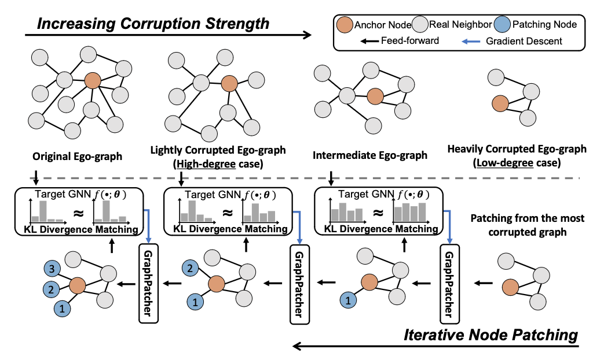

# Official repository for NeurIPS'23 paper: GraphPatcher: Mitigating Degree Bias for Graph Neural Networks via Test-time Augmentation



Hi all, this is the official repository for NeurIPS 2023 paper: **GraphPatcher: Mitigating Degree Bias for Graph Neural Networks via Test-time Augmentation**. Our paper can be found at [[OpenReview link]](https://openreview.net/forum?id=puupdGOWUp). We sincerely apprecaite your interests in our projects!

## Instruction

To reproduce our experiment, you first need to train a GNN model that GraphPatcher improves on. We provide sample bash scripts for Cora, Citeseer, and Pubmed in ```bash_script``` and you can simply run:

```
bash bash_script/cora_gcn.sh 
```
The resultant model checkpoint will be saved in the ```temp``` directory.

Then to conduct the test-time augmentation from GraphPatcher, we have prepared bash scripts in the ```bash_script``` directory. Training a GraphPatcher can be done by:

```
bash bash_script/cora.sh <GPU_ID>
```

Predictions given by GraphPatcher with different numbers of patched node are saved in the ```outputs``` directory.


## Dependencies and Environments
The package we use include:
    
    * DGL 0.9.0
    * PyTorch 1.12.0

## Cite
If you find this repository useful in your research, please cite our paper:

```bibtex
@article{ju2023graphpatcher,
  title={GraphPatcher: Mitigating Degree Bias for Graph Neural Networks via Test-time Augmentation},
  author={Ju, Mingxuan and Zhao, Tong and Yu, Wenhao and Shah, Neil and Ye, Yanfang},
  journal={Advances in neural information processing systems},
  year={2023}
}
```

## Contact
Mingxuan Ju (mju2@nd.edu)
